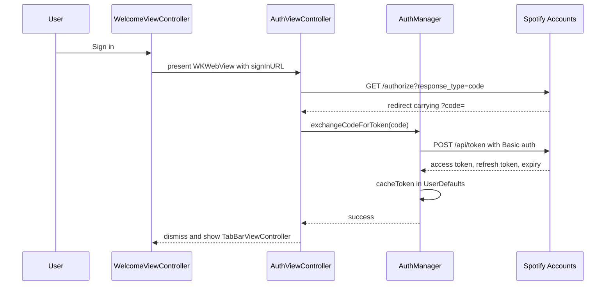
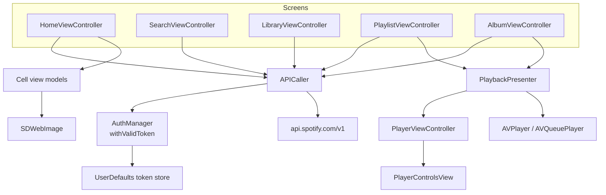

# Spotify

*A Spotify Web API client with the complete authorisation code flow, browsing, search, library and playback.*

     


## Overview

The application signs a user in against their real Spotify account, keeps the token pair fresh, and
then drives browse, search, playlist, album, category and library screens from the Web API. Playback
runs through `AVPlayer`, with a single presenter deciding whether a tap plays one track or a whole
queue.

The interface is written entirely in code. There is no storyboard.

## Authorisation flow



Every later call goes through `withValidToken`, which refreshes the token when it is within the
expiry window and queues callers that arrive while a refresh is already running, so a burst of
requests triggers only one refresh.

## Architecture



`APICaller` exposes one method per endpoint, each building a request through a shared
`createRequest` helper and decoding into a dedicated response model. Screens never see tokens or URLs.

## Implementation notes

- **Compositional layout for browse.** The home screen composes new releases, featured playlists and
  recommended tracks as three sections with different item sizing inside one collection view.
- **Playback behind a presenter.** `PlaybackPresenter` holds the track or track list, chooses between
  `AVPlayer` and `AVQueuePlayer`, and acts as the data source for the player screen, so no view
  controller owns the audio session.
- **Delegated controls.** `PlayerControlsView` reports intent (play, pause, next, back, volume) to its
  delegate instead of touching the player, which keeps the view reusable.
- **One response model per endpoint.** Search, categories, albums, playlists and recommendations each
  decode into their own `Codable` type rather than a shared loose dictionary.
- **Haptics as a service.** `HapticsManager` centralises feedback so call sites stay one line.

## Project structure

```
Spotify/
├── Managers/       AuthManager, APICaller, HapticsManager
├── Models/         Codable response types for every endpoint
├── ViewModels/     cell view models for browse, search and playlists
├── Presenter/      PlaybackPresenter
├── Controllers/    Core tab controllers and Other detail controllers
└── Views/          browse cells, player controls, headers, search result cells
```

## Requirements

Xcode 15 or later, iOS 17.4 or later, CocoaPods for SDWebImage. A Spotify developer client ID and
secret are required, together with a redirect URI registered in the Spotify dashboard.
